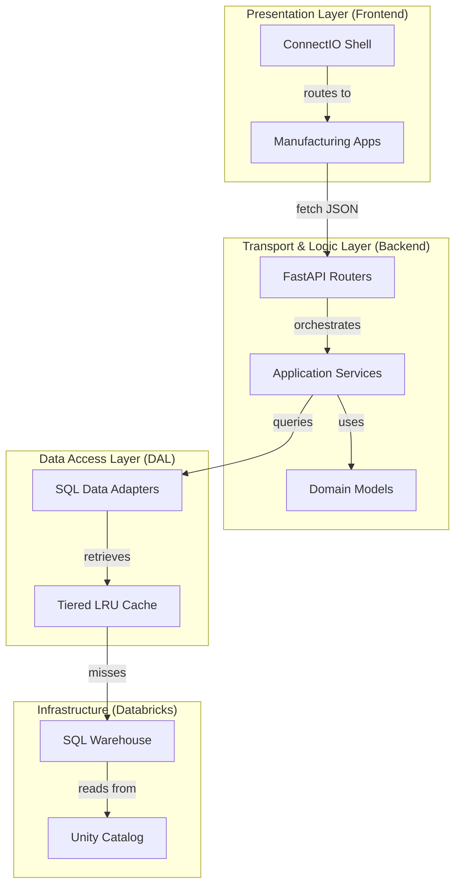

# 📐 System Architecture: ConnectIO-RAD

This document defines the high-level architecture, data flows, and design principles of the **ConnectIO-RAD** platform.

---

## 🏗️ High-Level Design

The platform is built as a **Modular Monolith** using an Nx monorepo. It leverages a modern stack optimized for the **Databricks Apps** ecosystem.

---

## 🌐 Bounded Contexts Map

We follow strict **Domain-Driven Design (DDD)**. Each application is partitioned into bounded contexts to prevent logic leakage and ensure maintainability.

| Application | Primary Bounded Contexts | Purpose |
| :--- | :--- | :--- |
| **Warehouse360** | `inventory_management`, `dispensary_ops`, `order_fulfillment` | Warehouse cockpit and staging efficiency. |
| **SPC** | `chart_config`, `process_control` | Statistical control and quality trending. |
| **Trace2** | `batch_trace`, `lineage_analysis`, `quality_record` | End-to-end material traceability. |
| **EnvMon** | `inspection_analysis`, `spatial_config` | Micro-organism heatmap and floor plans. |
| **POH** | `order_execution`, `genie_assist` | Manufacturing performance and AI insights. |

---

## 🔄 Data Flow

1.  **Ingestion**: SAP data is synchronized to **Databricks Unity Catalog** (Gold Layer).
2.  **Transformation**: Data is exposed via high-performance SQL Views in the `wh360`, `spc`, etc., schemas.
3.  **Consumption**: 
    *   **Backend DALs** in this repo execute async SQL against the Warehouse.
    *   **Shared DB Runtime** applies a tiered cache policy (e.g., Metadata: 15m, KPIs: 5m).
    *   **FastAPI Routers** serve the data as standardized JSON.
4.  **Visualization**: React frontends consume the APIs via **TanStack Query** for UI-side caching and deduplication.

---

## 📦 Shared Libraries Guide

| Library | Layer | Purpose |
| :--- | :--- | :--- |
| `shared-api` | Transport | App factory, security headers, JSON logging. |
| `shared-db` | DAL | Connection pools, async SQL, and safe identifier mapping. |
| `shared-auth` | Infra | OIDC/Databricks token validation and persona resolution. |
| `shared-ui` | UI | Kerry Design System tokens and Kerry-specific shell. |
| `shared-ddd / shared-manufacturing` | Domain | Base classes: `AggregateRoot`, `ValueObject`, `Entity`. |

---

## 🛡️ Architecture Guardrails

To prevent "Spaghetti Code," we enforce the following boundaries via `scripts/validate_repo_contract.py`:
- **Domain Isolation**: Domain packages MUST NOT import from `fastapi`, `pydantic` (transport), or `sql` (infra).
- **One-Way Dependencies**: App layers can only depend on layers below them: `Router → Application → Domain`.
- **Context Integrity**: Bounded contexts cannot import from sibling contexts; communication must be cross-app or via shared libraries.
