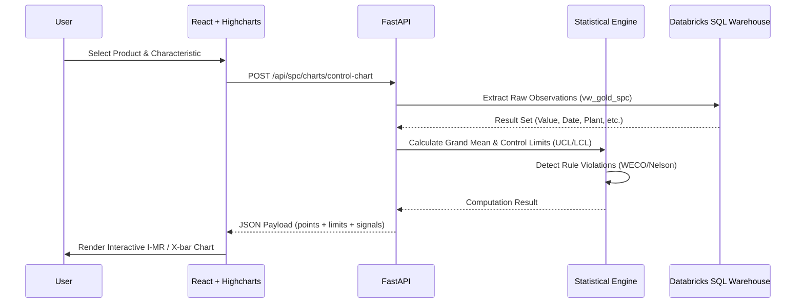

# SPC App Architecture

The Statistical Process Control (SPC) application delivers real-time charting and batch traceability for manufacturing quality teams.

## 🏗️ System Design

The application is structured as a high-performance analytics platform, leveraging Databricks for heavy-duty statistical computations.

### Frontend
- **Framework:** React with Vite.
- **Charting Library:** Highcharts (optimized for scientific and statistical visualization).
- **Key Views:**
    - **SPC Dashboard:** High-level overview of process health across multiple characteristics.
    - **Control Charts:** Interactive I-MR, X-bar R/S, and attribute charts.
    - **Capability Analysis:** Detailed histograms and capability indices (Cp, Cpk, Pp, Ppk).
    - **Traceability DAG:** A directed acyclic graph showing material lineage with health indicators.

### Backend
- **Framework:** FastAPI.
- **Statistical Engine:** Custom Python logic for WECO/Nelson rule detection and capability calculations, fallback to non-parametric methods for non-normal data.
- **Data Access:** Optimized SQL queries via `shared-db` targeting Databricks SQL Warehouse.
- **Key Modules:**
    - `spc_charts.py`: Generates the data points and control limits for various chart types.
    - `spc_analysis.py`: Performs capability analysis and rule violation detection.
    - `genie.py`: An experimental module for natural language querying of SPC data.

## 📊 Analytics Engine

The SPC engine is designed for robustness:
- **Auto-Stratification:** Dynamically slices data by Plant, Lot, or Operation without requiring manual re-configuration.
- **Rule Detection:** Real-time application of WECO and Nelson rules to detect out-of-control conditions.
- **Multivariate SPC:** Includes Hotelling's T² charts for monitoring multiple correlated characteristics simultaneously.

## 🔗 Data Flow

The following diagram illustrates how observation data is transformed into a real-time control chart:

1.  **Selection:** User selects a product, characteristic, and time range on the frontend.
2.  **Extraction:** The backend fetches raw observation data from the Unity Catalog `gold` schema.
3.  **Computation:** The Python backend calculates averages, standard deviations, control limits, and checks for rule violations.
4.  **Visualization:** Data is sent as a structured JSON payload to the frontend, where Highcharts renders the interactive visualizations.
