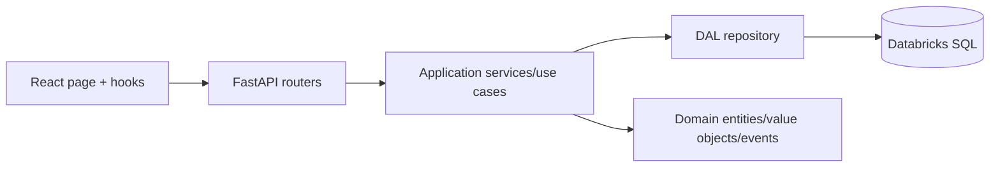

# Template Module

## Architecture

Template Module is a ConnectIO-RAD bounded context generated from the Rapid New Module system.

- Backend: FastAPI in `apps/template/backend/template_backend`
- Bounded context: `module_template` with `domain/`, `application/`, `dal/`, `infrastructure/`, and `routers/` boundaries
- Frontend: React + Vite + TanStack Query in `apps/template/frontend`
- Deployment: Databricks Apps via `databricks.yml`

## Architecture Diagram



## Domain Glossary

| Term | Meaning |
|---|---|
| Signal | Actionable manufacturing condition surfaced to operators. |
| Metric | KPI value projected from Databricks SQL or demo data. |
| Plant scope | Optional plant filter carried through API, application, and DAL layers. |

## Development

```bash
npx nx run template-backend:serve
npx nx run template-frontend:dev
npx nx run template-backend:test
npx nx run template-frontend:test
```

## Domain TODOs

- Replace demo repository rows with Databricks SQL queries in `module_template/dal/repository.py`.
- Add domain-specific value objects and invariants in `module_template/domain/value_objects.py` and `module_template/domain/entities.py`.
- Update i18n strings in all 16 locale stubs before production release.
