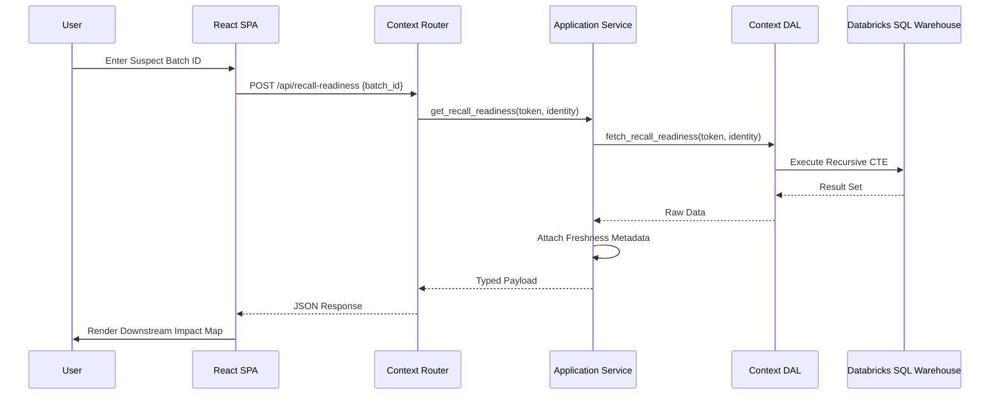

# Batch Traceability (trace2) Architecture

The `trace2` application provides comprehensive batch-level traceability across the supply chain, enabling rapid recall readiness and quality investigations.

## 🏗️ System Design

`trace2` is built for high-performance data retrieval, spanning multiple levels of the material lineage DAG.

### Frontend
- **Framework:** React with Vite.
- **Key Navigation:** A sidebar provides access to nine specialized traceability pages.
- **Pages:**
    - **Overview:** Summary of batch status and key metrics.
    - **Recall Readiness:** Critical view for identifying all products containing a specific suspect batch.
    - **Bottom-Up / Top-Down Lineage:** Visual representation of material flow.
    - **Mass Balance:** Reconciliation of input vs. output quantities.
    - **CoA (Certificate of Analysis):** Access to quality certificates for batches.

### Backend
- **Architecture:** Pragmatic DDD / Modular Monolith (Read-heavy CQRS).
- **Bounded Contexts:**
    - **batch_trace**: Core batch identity, header lookup, trace tree, summary, and impact.
    - **lineage_analysis**: Directional lineage, recall readiness, and supplier risk.
    - **quality_record**: CoA, quality results, quality lot summaries, and production history.
- **Framework:** FastAPI.
- **Data Access:** SQL queries are centralized in `libs/shared-trace`, wrapped by context-specific DAL adapters.
- **Performance:** Endpoints are rate-limited and use freshness tags to ensure data integrity while protecting the SQL Warehouse.

## 🛡️ Dependency Rules
To maintain modularity, we enforce strict boundary rules:
1. **Domain**: Standard library only. No framework or database dependencies.
2. **Application**: Coordinates between Domain and DAL. Handles freshness and business logic.
3. **DAL**: Infrastructure adapters over shared database utilities and the core trace engine.
4. **Router**: Pure transport layer. Parses requests, calls application services, and maps errors.

## 📊 Traceability Engine

The core value of `trace2` lies in its ability to traverse complex material relationships:
- **Recursive Lineage:** Uses SQL Common Table Expressions (CTEs) in `libs/shared-trace` to perform deep traversal.
- **Multi-Entity Tracking:** Tracks relationships between Raw Materials, Intermediates, Finished Goods, and Customer Deliveries.

## 🔗 Data Flow

