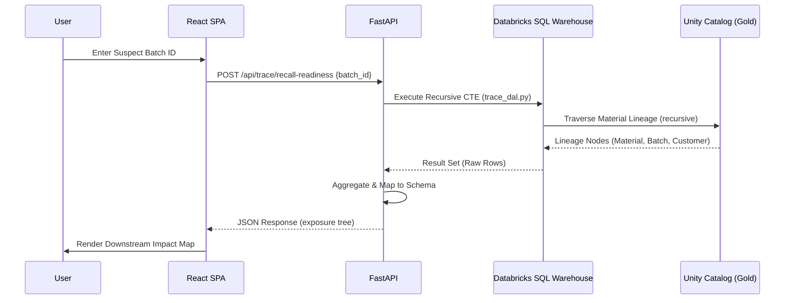

# Batch Traceability (trace2) Architecture

The `trace2` application provides comprehensive batch-level traceability across the supply chain, enabling rapid recall readiness and quality investigations.

## 🏗️ System Design

`trace2` is built for high-performance data retrieval, spanning multiple levels of the material lineage DAG.

### Frontend
- **Framework:** React with Vite.
- **Key Navigation:** A sidebar provides access to nine specialized traceability pages.
- **Pages:**
    - **Overview:** Summary of batch status and key metrics.
    - **Recall Readiness:** Critical view for identifying all products containing a specific suspect batch.
    - **Bottom-Up / Top-Down Lineage:** Visual representation of material flow.
    - **Mass Balance:** Reconciliation of input vs. output quantities.
    - **CoA (Certificate of Analysis):** Access to quality certificates for batches.

### Backend
- **Framework:** FastAPI.
- **Data Access:** All SQL queries are encapsulated in `trace_dal.py`, targeting `gold_*` views in Unity Catalog.
- **Performance:** Endpoints are rate-limited and use freshness tags to ensure data integrity while protecting the SQL Warehouse.
- **Key Modules:**
    - `trace.py`: Contains the 9 primary POST endpoints corresponding to the frontend pages.
    - `trace_dal.py`: Implements complex recursive SQL queries for multi-level lineage.

## 📊 Traceability Engine

The core value of `trace2` lies in its ability to traverse complex material relationships:
- **Recursive Lineage:** Uses SQL Common Table Expressions (CTEs) to perform deep traversal of material movements.
- **Multi-Entity Tracking:** Tracks relationships between Raw Materials, Intermediates, Finished Goods, and Customer Deliveries.

## 🔗 Data Flow

The following diagram illustrates the end-to-end flow for a Recall Readiness investigation:

1.  **Selection:** User provides a Batch ID or Lot ID in the frontend.
2.  **Request:** The frontend sends a POST request with the ID and optional filters (e.g., date range, depth).
3.  **Extraction:** The backend executes optimized SQL against the Unity Catalog gold views.
4.  **Response:** A structured JSON response containing the lineage nodes, quality results, or delivery records is returned.
5.  **Visualization:** The frontend renders the data using interactive tables and charts.
