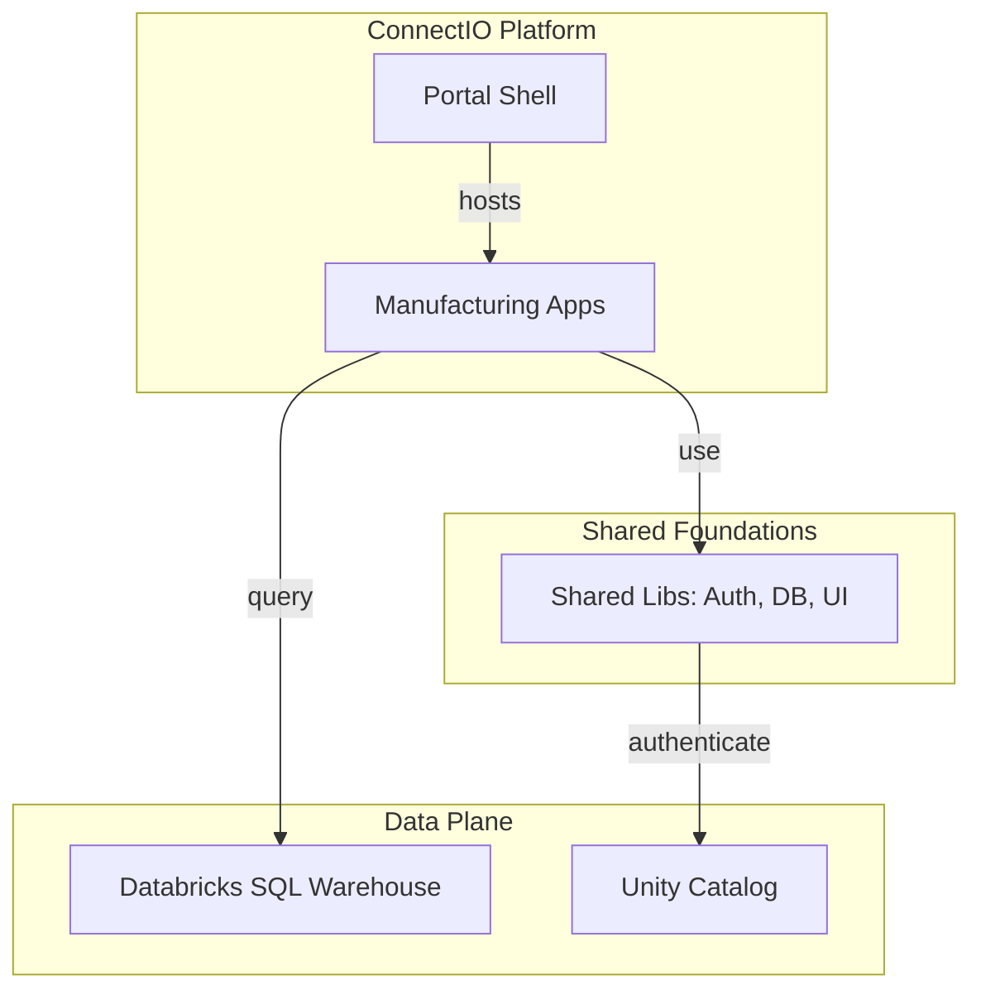

# 🚀 ConnectIO-RAD Developer Portal

Welcome to the central hub for the **ConnectIO-RAD** (Reporting and Dashboarding) platform. This monorepo is the engine behind Kerry's next-generation manufacturing and quality analytics, built on the **Databricks Apps** ecosystem.

## 📖 Table of Contents

- [**Onboarding Guide**](./ONBOARDING.md) - *Start here if you are new to the project.*
- [**System Architecture**](../ARCHITECTURE.md) - *DDD layers, Context Map, and Data Flows.*
- [**Development Guide**](./monorepo-development.md) - *Local setup, toolchains, and daily workflows.*
- [**Deployment & CI/CD**](./monorepo-deployment.md) - *How we move code from Local → UAT → Prod.*
- [**Engineering Mandates (DoD)**](../GEMINI.md) - *Our strict quality and documentation standards.*
- [**Domain Glossary**](./domain-glossary.md) - *The ubiquitous language of our manufacturing world.*

---

## 🎯 Project Purpose

ConnectIO-RAD provides industrial-grade applications for:
- **Manufacturing Visibility**: Process Order history, adherence, and real-time execution.
- **Quality Excellence**: Environmental monitoring, lab result analysis, and SPC.
- **Supply Chain**: Warehouse operations, inventory reconciliation, and fulfillment.

By centralizing these applications in a single monorepo, we ensure high code reuse, shared security standards, and a unified user experience (the **ConnectIO Shell**).

---

## 🛠️ Tech Stack & Versioning

| Component | Technology | Version / Standard |
| :--- | :--- | :--- |
| **Backend** | Python / FastAPI | 3.11+ |
| **Database** | Databricks SQL | Unity Catalog |
| **Frontend** | React / TypeScript | 19.x (Standard) |
| **Bundler** | Vite | 6.x+ |
| **Orchestration**| Nx | 22.x |
| **Dependency** | `uv` / `npm` | Workspaces |

---

## 📐 Architecture at a Glance

We use a **Modular Monolith** approach with strict **Domain-Driven Design (DDD)** boundaries.

---

## 🚦 Key Commands

| Action | Command |
| :--- | :--- |
| **Setup** | `npm install && uv sync` |
| **Run App** | `npx nx run <app-name>-frontend:dev` |
| **Test All** | `npm run test` |
| **Lint All** | `npm run lint` |
| **Graph** | `npm run graph` |

---

## 🤝 Contributing

We maintain a **high bar for quality**. All PRs must:
1. Pass **DDD Architecture Guardrails**.
2. Meet **≥75% Unit Test Coverage**.
3. Provide **100% i18n Translation Coverage** for 16 languages.
4. Adhere to the **10/10 Documentation Standard** (JSDoc/PEP 257).

*See [CONTRIBUTING.md](../CONTRIBUTING.md) for detailed guidelines.*
