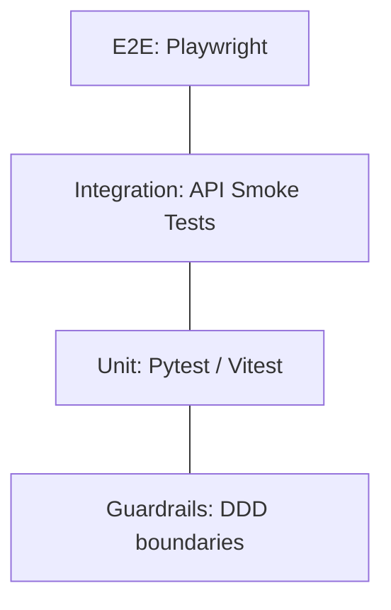

# 🧪 Testing Strategy: ConnectIO-RAD

Our testing strategy ensures that every manufacturing application in the monorepo is resilient, secure, and production-ready.

---

## 📐 The Testing Pyramid

---

## 📦 1. Unit Testing (Pytest & Vitest)
The foundation of our pyramid.
- **Backend**: Every function/class in `domain/` and `application/` must have a corresponding test in `tests/`.
- **Frontend**: Components and hooks are tested using Vitest and React Testing Library.
- **Standard**: ≥75% coverage is mandatory. Use realistic SAP IDs via `shared_domain.test_data`.

---

## 🔌 2. Integration & API Testing
We test the full vertical slice from the Router to the DAL.
- **FastAPI TestClient**: Used to simulate HTTP requests.
- **Mocks**: We mock external network calls (e.g., Databricks SQL) using realistic JSON responses.
- **Contract Testing**: Ensures that the JSON returned by the backend matches the frontend's TypeScript interfaces.

---

## 🎭 3. End-to-End (E2E) & Visual Regression
We use **Playwright** to validate critical user journeys.
- **Auth Simulation**: We use a `test-token` approach to bypass Databricks proxy auth in test environments.
- **Smoke Tests**: Run on every PR to ensure "happy path" stability.
- **Visual Regression**: Use `assertVisualMatch` to detect unintended CSS or layout changes in shared UI components.

---

## 🛡️ 4. Architecture Guardrails
Unlike functional tests, guardrails prevent structural decay.
- **Tool**: `pytest scripts/tests/test_ddd_architecture_guardrails.py`
- **Purpose**: Rejects PRs if the Domain layer imports from the Transport layer, or if bounded contexts cross-pollinate.

---

## 🏁 Execution Commands

| Target | Command |
| :--- | :--- |
| **All Tests** | `npm run test` |
| **Coverage** | `nx run <project>:test --coverage` |
| **E2E (Headless)**| `npx playwright test` |
| **E2E (UI)** | `npx playwright test --ui` |
