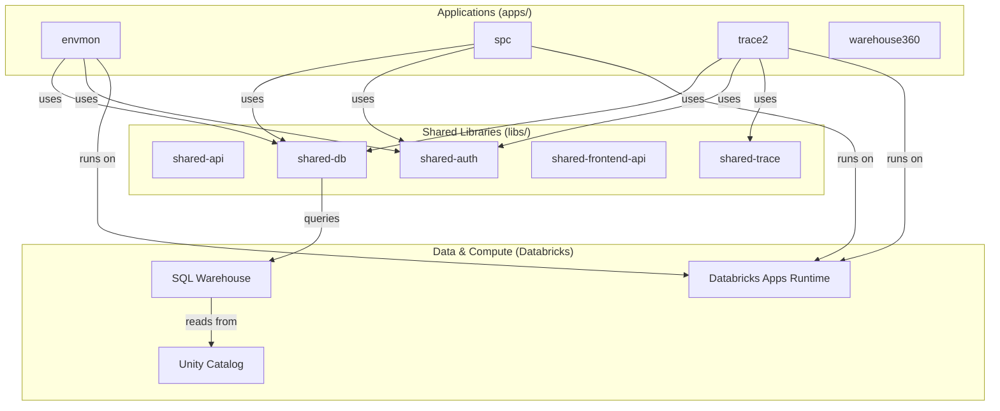

# Monorepo Architecture Overview

This document provides a high-level overview of the `ConnectIO-RAD` monorepo architecture, technology stack, and component interactions.

## 🏗️ High-Level Architecture

The repository follows a monorepo structure, housing multiple applications and shared libraries. It is designed to be deployed primarily as **Databricks Apps**, leveraging Databricks SQL Warehouse and Unity Catalog for data storage and management.



## 🚀 Technology Stack

### Backend
- **Language:** Python 3.10+
- **Framework:** FastAPI
- **Dependency Management:** `uv` (workspace-aware)
- **Deployment:** Databricks Apps (using `databricks.yml`)
- **Database:** Databricks SQL Warehouse (Unity Catalog)

### Frontend
- **Framework:** React (TypeScript)
- **Build Tool:** Vite
- **Dependency Management:** `npm` (workspaces)
- **State Management:** TanStack Query (React Query)
- **Styling:** Vanilla CSS / SCSS (Kerry Design System tokens)

### Monorepo Tooling
- **Orchestration:** [Nx](https://nx.dev/) is used to manage builds, tests, linting, and deployments across all projects.
- **Task Runner:** `nx affected` is used in CI/CD to run tasks only on changed components.

## 📦 Shared Libraries (`libs/`)

Shared libraries promote code reuse and consistency across applications:

- **`shared-api`**: Common FastAPI utilities, error handlers, and middleware.
- **`shared-auth`**: Authentication and security logic, specifically for Databricks environment integration.
- **`shared-db`**: Database connection management and asynchronous SQL execution utilities.
- **`shared-frontend-api`**: Shared TypeScript clients and models for frontend-backend communication.
- **`shared-trace`**: Domain-specific logic for material and batch traceability.

## 📂 Project Structure

```text
.
├── apps/               # Independent applications
│   ├── envmon/         # Environmental Monitoring
│   ├── spc/            # Statistical Process Control
│   ├── trace2/         # Batch Traceability
│   └── warehouse360/   # Warehouse Operations Cockpit
├── libs/               # Shared Python and TypeScript libraries
├── docs/               # Global documentation
├── ai-context/         # Semantic models and agent rules
└── package.json        # Global Node.js configuration
```
